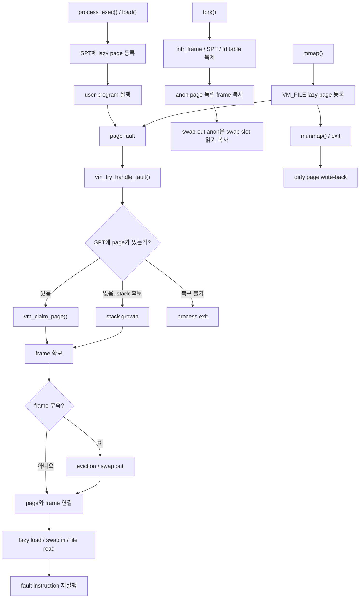

# Pintos Virtual Memory Project

KAIST Pintos `Project 3: Virtual Memory`를 팀 단위로 구현한 저장소입니다.

기존 Project 1 Threads, Project 2 User Programs 구현 위에 Supplemental Page Table, lazy loading, stack growth, `mmap()`/`munmap()`, eviction/swap, fork lifecycle을 연결했습니다. 실제 Pintos 소스 코드는 `pintos/` 아래에 있고, 구현 기록과 협업 기준은 `docs/`에 정리했습니다.

## 한눈에 보기



핵심은 단순합니다. SPT는 user virtual page의 장기 상태를 보관하고, page fault가 발생하면 SPT를 기준으로 frame을 붙입니다. frame이 부족하면 eviction과 swap으로 기존 frame을 비워 재사용합니다.

함수별 상세 흐름은 [VM 구현 흐름 상세 설명](docs/week11-12-vm-implementation-flow.md)에 정리했습니다.

## 구현 범위

- Supplemental Page Table 기반 page lookup/insert/remove
- frame allocation, frame table, page claim
- ELF segment lazy loading과 page fault 기반 lazy claim
- stack growth와 VM-aware syscall pointer validation
- fork 시 `intr_frame`, SPT/page/frame, fd table 복제
- `dup2()` 관계를 유지하는 fd table 복제
- swap-out된 anon page의 fork 복제
- `mmap()` / `munmap()`과 file-backed page lifecycle
- dirty file-backed page write-back
- second-chance 기반 eviction
- anon/file-backed swap in/out
- Project 1/2, filesys/base 회귀 확인 대상 관리

Extra COW(`cow-simple`)는 필수 VM 구현과 분리된 선택 과제로 남겼습니다.

## 빠른 시작

1. Docker Desktop을 설치합니다.
2. VSCode에서 이 저장소를 엽니다.
3. `Dev Containers: Reopen in Container`로 컨테이너 환경에 들어갑니다.
4. 필요하면 컨테이너 셸에서 환경을 활성화합니다.

```bash
source /workspaces/week11-team-03-pintos-vm/pintos/activate
```

자세한 환경 구성 방법은 [개발환경 구축 가이드](docs/dev-environment.md)를 참고하세요.

## 빌드와 테스트

VM 테스트는 `pintos/vm`에서 실행합니다.

```bash
cd /workspaces/week11-team-03-pintos-vm/pintos/vm
make check
```

개별 테스트는 필요한 `.result` target을 지정해 실행할 수 있습니다.

```bash
make tests/vm/mmap-read.result
make tests/vm/swap-fork.result
```

Project 1/2 회귀 테스트는 각 프로젝트 디렉터리에서 실행합니다.

```bash
cd /workspaces/week11-team-03-pintos-vm/pintos/threads
make check

cd /workspaces/week11-team-03-pintos-vm/pintos/userprog
make check
```

## 저장소 구조

| 경로 | 설명 |
|------|------|
| `README.md` | 저장소 개요와 최종 구현 요약 |
| `docs/dev-environment.md` | Docker, VSCode DevContainer 기반 개발환경 안내 |
| `docs/week11-12-vm-implementation-flow.md` | VM 구현 흐름 상세 설명 |
| `docs/week11-12-implementation-plan.md` | 2026-05-20 기준 VM 구현 기록과 모듈별 설계 |
| `docs/week11-12-collaboration.md` | 협업 방식, 리뷰 기준, 테스트 운영 원칙 |
| `docs/kaist-pintos-gitbook/` | KAIST Pintos GitBook 참고 문서 |
| `docs/reference/gitbook-reference-links.md` | KAIST Pintos GitBook 원문 링크 모음 |
| `pintos/README.md` | Pintos 원본 안내 문서 |
| `pintos/threads/` | Project 1 thread/synchronization 관련 코드 |
| `pintos/userprog/` | Project 2 user process, syscall, process lifecycle 관련 코드 |
| `pintos/vm/` | Project 3 virtual memory 구현 코드 |
| `pintos/include/vm/` | VM page, anon, file-backed 관련 header |
| `pintos/tests/vm/` | Project 3 VM 테스트 코드 |
| `.devcontainer/` | 팀 공통 컨테이너 개발환경 설정 |

## 참고 문서

- [VM 구현 흐름 상세 설명](docs/week11-12-vm-implementation-flow.md)
- [Virtual Memory 구현 기록](docs/week11-12-implementation-plan.md)
- [협업 문서](docs/week11-12-collaboration.md)
- [개발환경 구축 가이드](docs/dev-environment.md)
- [Pintos 원본 안내](pintos/README.md)
- [KAIST Pintos Manual](https://casys-kaist.github.io/pintos-kaist/)

## 개발 원칙

- tracked text 파일은 UTF-8 without BOM과 LF 줄바꿈을 사용합니다.
- `.gitattributes`의 `* text=auto eol=lf` 정책을 기준으로 합니다.
- 구현 변경은 관련 테스트와 회귀 가능성을 함께 확인합니다.
- page, frame, swap slot, file reference, aux처럼 소유권이 있는 자원은 생성 시점과 해제 경로를 설명할 수 있어야 합니다.
