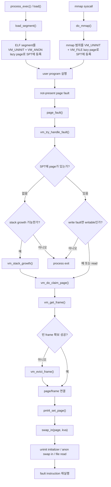
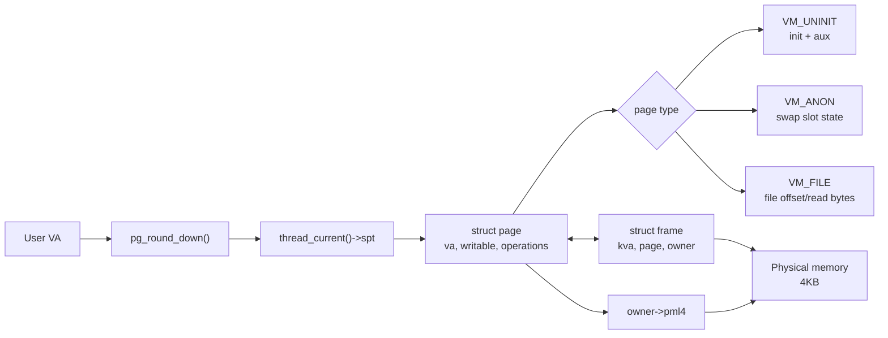
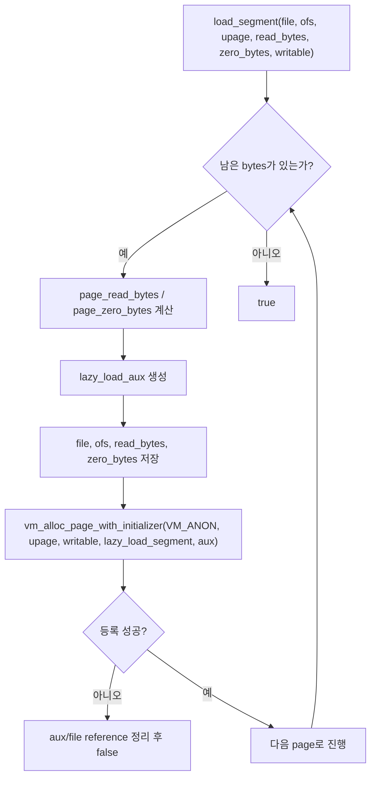
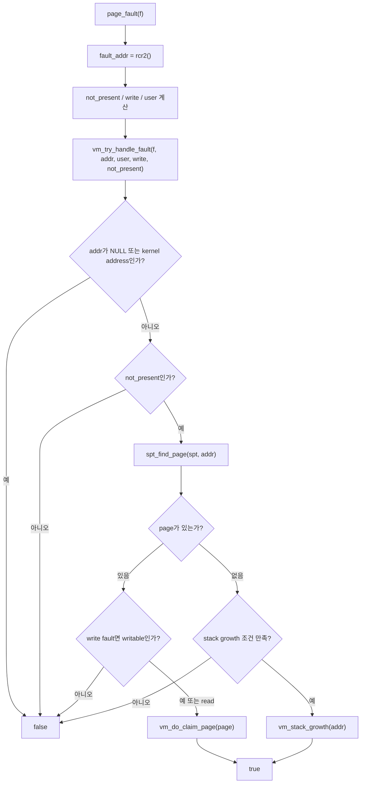
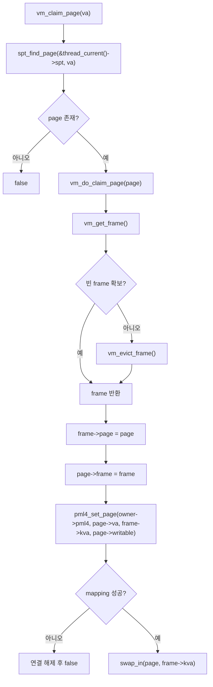
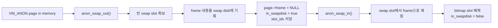
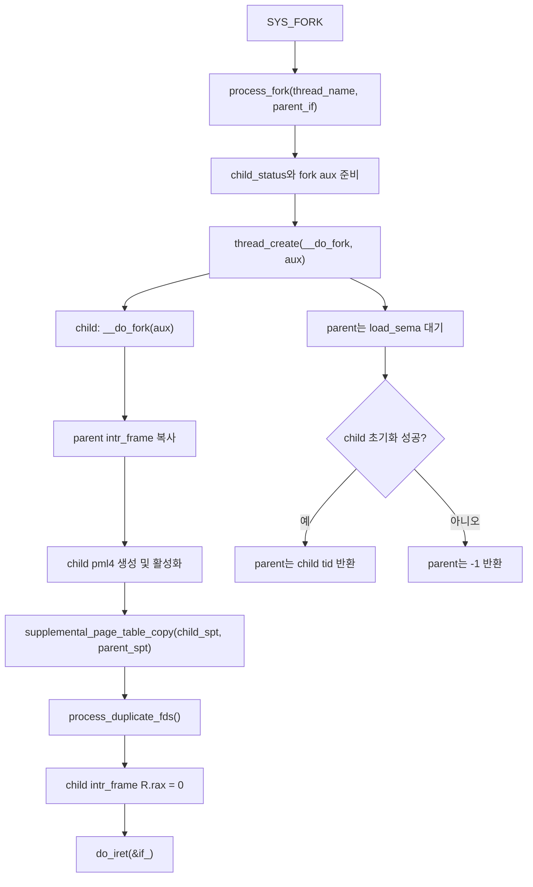
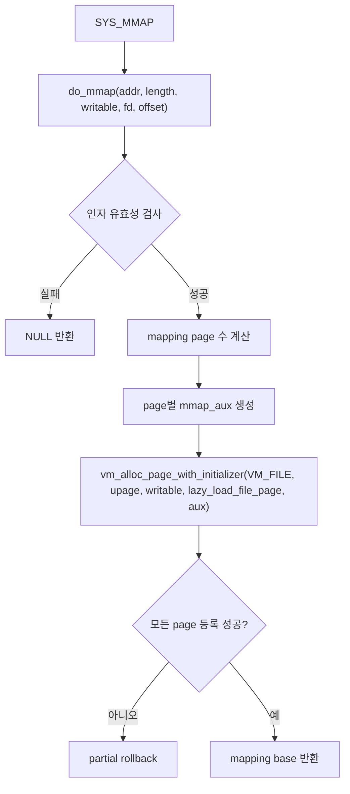
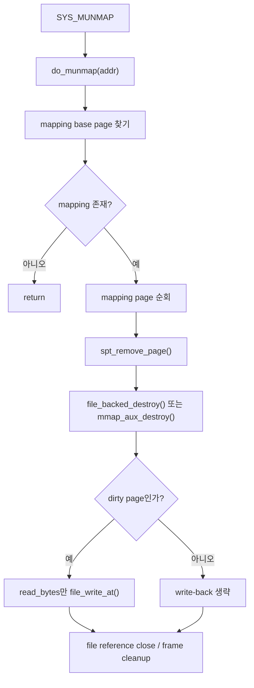

# Pintos VM 구현 흐름 상세 설명

## 1. 문서 목적

이 문서는 2026-05-20 기준 Pintos `Project 3: Virtual Memory` 구현이 어떤 흐름으로 동작하는지 설명한다. 날짜별 구현 기록은 [구현 기록](week11-12-implementation-plan.md)을 보고, 협업과 리뷰 기준은 [협업 문서](week11-12-collaboration.md)를 따른다.

이 문서는 코드를 읽을 때 다음 질문에 답하는 것을 목표로 한다.

- SPT, PML4, page, frame은 각각 어떤 책임을 갖는가?
- lazy loading page는 언제 실제 frame을 얻는가?
- page fault는 언제 복구되고 언제 process를 종료시키는가?
- fork는 부모의 VM 상태를 자식에게 어떻게 복제하는가?
- mmap file-backed page와 anon swap page는 cleanup 시점에 어떻게 정리되는가?

## 2. 전체 흐름

현재 구현의 중심 흐름은 아래와 같다.

```text
SPT는 user virtual page의 장기 상태를 보관하고,
page fault가 발생하면 SPT를 기준으로 frame을 붙이며,
frame이 부족하면 eviction/swap으로 기존 frame을 비워 재사용한다.
```



## 3. 핵심 자료구조

### SPT와 PML4

SPT와 PML4는 서로 다른 역할을 맡는다.

| 구조 | 역할 |
|------|------|
| SPT | lazy page, loaded page, swap-out page, mmap page의 장기 상태를 보관하는 커널 자료구조 |
| PML4 | 현재 CPU가 실제 주소 변환에 사용하는 page table |

PML4에 mapping이 없어서 page fault가 발생해도, SPT에 복구 가능한 page 정보가 있으면 정상적인 VM 동작으로 처리할 수 있다.

### Page와 Frame

`struct page`는 user virtual page 하나의 상태를 나타내고, `struct frame`은 실제 물리 메모리 4KB frame을 추적한다.



현재 구현에서 중요한 필드는 다음과 같다.

| 구조체 | 핵심 필드 | 의미 |
|------|------|------|
| `struct page` | `va` | page-aligned user virtual address |
| `struct page` | `writable` | write fault 복구 가능 여부 |
| `struct page` | `operations` | `VM_UNINIT`, `VM_ANON`, `VM_FILE`별 동작 테이블 |
| `struct page` | `frame` | 현재 memory에 올라와 있으면 연결된 frame |
| `struct frame` | `kva` | kernel virtual address로 접근하는 물리 frame |
| `struct frame` | `page` | 이 frame을 현재 사용하는 page |
| `struct frame` | `owner` | PML4 mapping을 소유한 thread |
| `struct frame` | `in_frame_table` | frame table list 등록 여부 |

## 4. SPT 기본 동작

SPT는 thread별 hash table로 관리한다. key는 `pg_round_down(va)`로 정렬된 user virtual page 주소다.

```text
supplemental_page_table_init()
  -> hash_init()

spt_find_page(spt, va)
  -> va를 pg_round_down()
  -> hash_find()

spt_insert_page(spt, page)
  -> page->va가 page-aligned인지 확인
  -> hash_insert()

spt_remove_page(spt, page)
  -> hash_delete()
  -> vm_dealloc_page(page)
```

중요한 기준은 SPT entry가 "현재 frame이 있는 page"만 뜻하지 않는다는 점이다. 아직 fault되지 않은 lazy page와 swap-out되어 frame이 없는 page도 SPT에 남아 있어야 한다.

## 5. Lazy Loading

ELF segment는 `load_segment()`에서 page 단위로 나뉜다. 이때 파일 내용을 즉시 읽지 않고, page fault 때 사용할 metadata를 SPT에 등록한다.



실행 파일 lazy page는 처음에는 파일에서 읽지만, fault 후에는 anonymous page처럼 동작한다. 그래서 `VM_UNINIT + VM_ANON`으로 등록하고, 실제 초기화 시 `anon_initializer()`와 `lazy_load_segment()`가 이어진다.

aux는 page마다 독립적으로 가져야 한다. 부모와 자식이 같은 aux를 공유하거나 여러 page가 같은 aux를 공유하면 initialize 또는 destroy 시점에 dangling pointer가 생길 수 있다.

## 6. Page Fault 처리

`page_fault()`는 fault address와 fault 원인을 읽고 `vm_try_handle_fault()`로 복구 가능성을 넘긴다.



write fault라고 해서 항상 권한 위반은 아니다. 아직 mapping되지 않은 writable lazy page에 처음 쓰는 경우도 not-present write fault로 들어올 수 있다. 따라서 SPT에서 page를 찾은 뒤 `page->writable`을 확인해야 한다.

## 7. Stack Growth

SPT에 page가 없을 때만 stack growth 후보를 검사한다. 아무 주소나 stack으로 인정하면 잘못된 포인터 접근까지 정상 접근으로 복구하게 된다.

현재 stack growth 판단은 다음 기준을 함께 본다.

- fault address가 user address인지
- `USER_STACK` 아래인지
- stack limit 안에 있는지
- fault address가 user `rsp` 근처인지
- syscall 경로에서는 syscall 진입 당시 저장한 user `rsp`를 사용할 수 있는지

stack growth가 가능하면 fault address를 `pg_round_down()`한 뒤 anonymous page를 만들고 claim한다.

```text
vm_stack_growth(addr)
  -> upage = pg_round_down(addr)
  -> vm_alloc_page(VM_ANON | VM_MARKER_0, upage, true)
  -> vm_claim_page(upage)
```

`VM_MARKER_0`는 stack page임을 표시하기 위한 marker로 사용한다. 첫 stack page도 같은 marker를 붙여 등록한다.

## 8. Frame Claim과 Eviction

`vm_claim_page()`는 SPT에서 page를 찾고, `vm_do_claim_page()`가 실제 frame 연결을 수행한다.



frame table은 user frame을 전역 list로 추적한다. frame 부족 시 `vm_get_victim()`은 accessed bit를 이용한 second-chance 방식으로 victim을 고르고, `vm_evict_frame()`이 victim page의 type별 `swap_out()`을 호출한다.

eviction 후에는 PML4 mapping, page/frame 연결, frame owner 상태를 정리한다. SPT entry는 제거하지 않는다. 제거해버리면 나중에 page fault가 발생했을 때 swap slot 또는 backing file에서 복구할 정보를 잃는다.

## 9. Anon Swap

Anonymous page는 swap disk slot을 backing store로 사용한다.



process exit 또는 SPT kill 중 anonymous page가 swap slot을 소유하고 있으면 bitmap slot을 해제해야 한다. 그렇지 않으면 process는 사라졌는데 swap 공간은 계속 사용 중으로 남는다.

## 10. Fork와 SPT Copy

`fork()`는 부모의 register state만 복사하는 작업이 아니다. Project 3에서는 부모의 주소 공간 의미가 SPT에 있으므로 SPT도 자식에게 복제해야 한다.



page type별 복제 정책은 다르다.

| 부모 page 상태 | 자식 복제 방식 |
|------|------|
| `VM_UNINIT + VM_ANON` | lazy metadata를 복제한 뒤 자식 page를 즉시 claim |
| loaded `VM_ANON` | 자식 anon page와 frame을 새로 만들고 부모 frame 내용을 `memcpy()` |
| swap-out `VM_ANON` | 부모 swap slot을 해제하지 않고 읽어서 자식 frame에 복사 |
| `VM_UNINIT + VM_FILE` mmap page | 현재 테스트 정책에 맞춰 fork에서 상속하지 않음 |
| fault-in된 `VM_FILE` mmap page | 현재 테스트 정책에 맞춰 fork에서 상속하지 않음 |

swap-out된 anon page가 핵심 예외다. 부모 page를 `anon_swap_in()`하면 부모의 swap slot 소유권이 사라질 수 있다. 그래서 `anon_copy_from_swap()`은 부모 swap slot을 읽기만 하고, bitmap과 부모 page metadata는 유지한다.

```text
parent anon page
  frame == NULL
  in_swapdisk == true
  slot_idx == N

fork()
  -> child anon page claim
  -> anon_copy_from_swap(parent_page, child_frame->kva)
  -> parent slot_idx와 bitmap 상태 유지
```

## 11. FD Table과 Process Lifecycle

fork는 VM 상태뿐 아니라 Project 2 process 상태도 함께 복제해야 한다.

현재 fd table은 array-backed table이고, fd entry는 reference-counted `fd_handle`을 가리킨다. `dup2()`로 같은 file offset을 공유하던 fd들은 fork 후 자식 안에서도 같은 관계를 유지해야 한다. 이를 위해 `process_duplicate_fds()`가 부모 handle과 자식 handle의 대응 관계를 관리한다.

process lifecycle에서 함께 유지하는 항목은 다음과 같다.

- `child_status`: fork/load 성공 여부, exit status, wait 1회 제한, 부모/자식 참조 수
- fd cleanup: process exit 또는 fork 실패 시 열린 fd와 child-side handle 정리
- exec file write-deny cleanup: exec file에 대한 write deny 해제와 close
- SPT cleanup: process exit 또는 exec 성공 후 이전 address space 제거

VM 변경이 Project 2 회귀를 만들지 않으려면 fork 실패, exec 교체, process exit, wait 경로를 함께 확인해야 한다.

## 12. mmap과 File-backed Page

`mmap()`은 파일 내용을 즉시 모두 읽지 않고, file-backed lazy page를 SPT에 등록한다.



검증 조건에는 `addr == NULL`, page misalignment, invalid offset, `length == 0`, invalid fd, zero-length file, 기존 SPT page와 overlap, user range overflow가 포함된다.

fault 전후의 metadata는 분리한다.

| 상태 | 구조체 | 역할 |
|------|------|------|
| fault 전 `VM_UNINIT + VM_FILE` | `struct mmap_aux` | lazy load에 필요한 file, offset, read/zero bytes, mapping 범위 보관 |
| fault 후 `VM_FILE` | `struct file_page` | swap in/out, dirty write-back, cleanup에 필요한 file-backed metadata 보관 |

같은 `VM_UNINIT`이라도 ELF lazy page와 mmap lazy page는 aux owner가 다르다. 따라서 uninit destroy 경로에서 `VM_ANON` aux와 `VM_FILE` aux를 구분해 해제한다.

## 13. munmap과 Dirty Write-back

`munmap()`은 mapping 시작 주소에서 page count를 확인하고, 같은 mapping에 속한 page를 SPT에서 제거한다.



dirty write-back은 page의 `read_bytes`만 파일에 기록한다. 마지막 page의 zero 영역까지 파일에 쓰면 파일 크기와 내용이 잘못 바뀔 수 있다.

`close(fd)`가 호출되어도 mmap mapping은 유지되어야 하므로 mmap page는 원본 fd와 독립적인 file reference를 갖는다.

## 14. Cleanup 기준

VM 구현에서는 page, frame, aux, file reference, swap slot의 소유권을 분명히 해야 한다.

| 자원 | 생성 시점 | 해제 시점 |
|------|------|------|
| `struct page` | `vm_alloc_page*()` | `spt_remove_page()`, `supplemental_page_table_kill()` |
| uninit aux | lazy page 등록 | lazy initialize 성공 후 또는 uninit destroy |
| frame | `vm_get_frame()` | eviction, page destroy, process cleanup |
| swap slot | `anon_swap_out()` | `anon_swap_in()` 또는 anon destroy |
| mmap file reference | mmap page 등록 또는 fault-in | `munmap()`, process exit, rollback |
| fd handle | open/dup/fork fd duplication | close, process exit, fork failure cleanup |

특히 SPT kill은 단순히 hash table을 비우는 함수가 아니다. 각 page type의 destroy 경로를 통해 page 내부 자원을 정리하는 진입점이다.

## 15. 코드 읽기 순서

처음 코드를 읽을 때는 아래 순서가 가장 덜 헷갈린다.

1. `pintos/include/vm/vm.h`: `struct page`, `struct frame`, page operations 확인
2. `pintos/vm/vm.c`: SPT, frame claim, eviction, SPT copy/kill 확인
3. `pintos/userprog/process.c`: `load_segment()`, `lazy_load_segment()`, `process_fork()`, `__do_fork()` 확인
4. `pintos/userprog/exception.c`: `page_fault()`에서 VM으로 넘어가는 경로 확인
5. `pintos/userprog/syscall.c`: syscall pointer validation, `mmap`, `munmap`, fd lifecycle 확인
6. `pintos/vm/anon.c`: anon swap in/out, swap slot cleanup, swap-out anon fork copy 확인
7. `pintos/vm/file.c`: mmap lazy load, file-backed swap in/out, dirty write-back 확인

## 16. 구현 판단 기준

VM 변경을 리뷰할 때는 테스트 통과 여부만 보지 않고 아래 질문을 함께 확인한다.

- 이 page는 SPT에는 있지만 PML4에는 없을 수 있는가?
- page fault 후 instruction을 재실행했을 때 같은 fault가 반복되지 않는가?
- write fault에서 `page->writable`을 확인하는가?
- fork 후 부모와 자식이 같은 frame을 공유하지 않는가?
- swap slot을 읽는 작업과 소비하는 작업을 구분하는가?
- mmap page의 file reference가 fd close와 독립적인가?
- dirty write-back은 필요한 byte 범위만 수행하는가?
- 실패 경로에서 page, frame, aux, file, swap slot이 남지 않는가?
